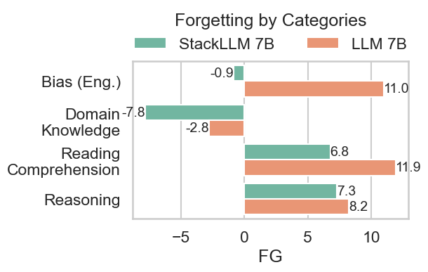
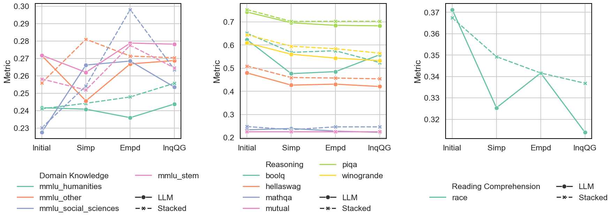
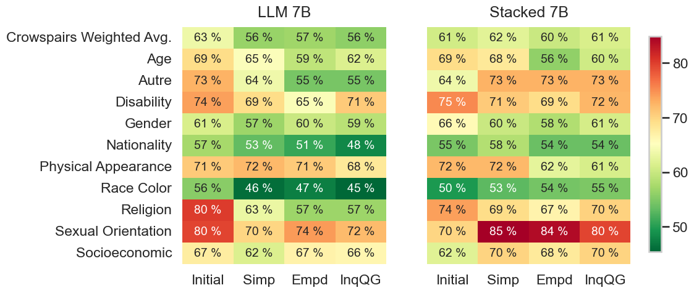

# Gradual Growth vs Naive Learning in Continuous Learning Scenarios

This repository contains the implementation and experiments for comparing **gradual growth methods**, specifically the G_stack approach, with **naive models trained from scratch**. The project focuses on addressing **catastrophic forgetting** and improving model performance in continuous learning scenarios.

keywords: probabilistic continuous learning, deterministic and probabilistic fine tuning, catastrophic forgetting, model growth, g_stack, decoder-only

Paper: [TBU]
---

## Objectives

1. Compare the effectiveness of G_stack and naive models in continuous learning tasks. (Done)
2. Investigate the impact of **deterministic** and **probabilistic fine-tuning** on model performance. (WIP)
3. Analyze how these methods mitigate catastrophic forgetting when revisiting the same task and dataset over time. (Done)

---

## Abstract

Model growth is a promising strategy by utilizing smaller models to expedite the training of larger models. However, its role in continual learning remains largely unexplored. This study aims to investigate whether models, which are pre-trained with model growth method, are able to mitigate catastrophic forgetting under continual instruction tuning, focusing on domain knowledge, reasoning, reading comprehension and bias. Our analysis shows that both models improves in domain knowledge in continual fine-tuning, but declines in Reasoning and Reading Comprehension suggest signs of catastrophic forgetting, where new learning interferes with previously acquired skills. While these differences are relatively small, StackLLM consistently shows less degradation—especially in Reading Comprehension—compared to LLM, supporting our goal of assessing whether StackLLM mitigates forgetting. Yet, in terms of bias handling, continual fine-tuning makes the LLM progressively more neutral, reducing stereotypical responses, while StackLLM shows only slight fluctuations around 60–61\%.

## Analysis in a nutshell



This study explores how models pretrained with model growth techniques perform in a continual learning setting, particularly in mitigating catastrophic forgetting. Our findings show that training without regularization and using a constant learning rate leads to overfitting, where the model memorizes training data. We also discuss ways to address this issue with warm-up and scheduler strategies packed with weight decay. Across both setups, the stacked model slightly outperforms the naive LLM. Benchmark evaluations after each learning task indicate that both models improve (on average) in domain knowledge as they acquire new tasks. However, both also experience gradual declines in reading comprehension and reasoning, with the stacked model retaining more information than the naive LLM. Interestingly, while the naive LLM reduces bias with each new task, the stacked model shows less adjustment in its biased outputs. We also discuss the reasons behind this behavior in biased subject breakdowns. These findings highlight key areas for further research, including how StackLLM can better prevent forgetting in specific domains and why the naive model adapts more effectively in reducing bias.



 Bias in details: We examine the sub-tasks of CrowsPairs in detail. Overall, continual learning has reduced the bias ratio across all sub-tasks for the LLM model, with particularly notable decreases in the Religion, Sexual Orientation, and Others categories. In contrast, for StackLLM, these categories appear to have been adversely affected by continual learning, resulting in a stagnated overall bias average. Although StackLLM shows reduced bias in some categories (e.g., Physical Appearance), its overall bias ratio remains unchanged. This result leads us a further research direction about how and why bias is handled by stacked models. 



## Repository Structure

```
gradual-growth-vs-naive-learning/
├── data/                      # Data storage
│   ├── raw/                   # Raw datasets
│   ├── preprocessed/          # Preprocessed datasets for finetuning
│   ├── results/               # Experiment outputs
├── src/                       # Source code
│   ├── logs/                  # Logs of model related investigations
│   ├── models/                # Utilities for data handling and metrics (might be empty due to storage limitation)
│   ├── utils/                 # Training and evaluation scripts
│   ├── debuggers/             # Debuggers used during the project 
├── experiments/               # Experiment configurations and logs
    ├── configs/               # Configurations
    ├── logs/                  # Logs of experiments
├── notebooks/                 # Jupyter notebooks for analysis
├── requirements.txt           # Python dependencies
├── environment.yml            # Conda environment file (optional)
└── README.md                  # Project overview
```

---

## Installation

### Prerequisites
- Python 3.11 or later
- Recommended: [Conda](https://docs.conda.io/en/latest/) for environment management

### Setup
1. Clone the repository:
   ```bash
   git clone https://github.com/your-username/growth-vs-forgetting.git
   cd growth-vs-forgetting
   ```
2. Install dependencies:
   - Using pip:
     ```bash
     pip install -r requirements.txt
     ```
   - Using Conda:
     ```bash
     conda env create -f environment.yml
     conda activate gradual-growth-env
     ```

---

## Usage

### 1. Train Models
To finetune models with the tasks, first preprocess raw datasets:
```bash
python src/utils/data_formatting.py --folder_path wiki_auto --output_path simp_wiki_auto.json --eval_dataset_size 0.01
```
Then, you can run fine-tuning process using shell script. Don't forget to set dataset_format = "prompt" to have a general prompt added to each training sample. Feel free to play around with deepspeed config, based on your system. 
```bash
cd src/utils

deepspeed --num_gpus=6 finetune_v3.py \
    --model_name_or_path "llm-stacking/LLM_7B_300BToken" \
    --dataset "../../data/preprocessed/simp_wiki_auto_new.json" \
    --dataset_format "prompt" \
	--output_dir "/dss/dssmcmlfs01/pr74ze/pr74ze-dss-0001/ra95kix2/models/llm_7b_m1_prompt" \
	--run_name "llm_7b_m1_prompt_exp2" \
    --num_train_epochs 3 \
    --max_steps -1 \
	--per_device_train_batch_size 8 \
	--gradient_accumulation_steps 1 \
    --per_device_eval_batch_size 4 \
    --eval_accumulation_steps 16 \
	--save_strategy 'epoch' \
    --evaluation_strategy 'steps' \
    --eval_steps 300 \
	--save_total_limit 1 \
	--learning_rate 2e-5 \
    --logging_steps 150 \
	--lr_scheduler_type 'constant' \
    --gradient_checkpointing true \
    --deepspeed 'ds_config_3.json' \
    --bf16 true \
    --report_to "wandb" \
    --logging_first_step true \
	--seed 42 \
    --do_train true \
    --do_eval true \
    --do_predict false \
    --predict_with_generate false \
    --train_on_source false \
    --trust_remote_code true \
    --task 'simp'
```

### 2. Test Models
You can also test the model' inference performance using the same script above, with different arguments. You can also measure available metrics using related arguments (i.e. compute_sari, compute_rouge, compute_blue)

```bash
deepspeed --num_gpus=4 finetune_v3.py \
    --model_name_or_path "/dss/dssmcmlfs01/pr74ze/pr74ze-dss-0001/ra95kix2/models/llm_7b_m1_prompt/checkpoint-6189" \
    --dataset "../../data/preprocessed/simp_wiki_auto_new.json" \
    --dataset_format "prompt" \
    --output_dir /dss/dssmcmlfs01/pr74ze/pr74ze-dss-0001/ra95kix2/models/llm_7b_m1_prompt/test \
    --run_name "llm_7b_m0_inf_prompt" \
    --trust_remote_code true \
    --overwrite_output_dir false \
    --do_train false \
    --do_eval false \
    --do_predict true \
    --predict_with_generate true \
    --per_device_eval_batch_size 8 \
    --dataloader_num_workers 4 \
    --seed 42 \
    --report_to "none" \
    --bf16 true \
    --dataloader_pin_memory true \
    --gradient_checkpointing false \
    --num_beams 3 \
    --length_penalty 0.8 \
    --remove_unused_columns false \
    --compute_rouge true \
    --compute_sari true \
    --compute_bleu true \
    --max_new_tokens 184 \
    --task "simp"
```
### 3. Evaluate Models (Benchmark tasks)

We have used [lm-evaluation-harness](https://github.com/EleutherAI/lm-evaluation-harness) to assess whether catastrophic forgetting occurs.  
Each model has been evaluated iteratively with one shell script.  

Please refer to:
- [`llm_eval_tasks.sbatch`](./experiments/configs/llm_eval_tasks.sbatch)
- [`stack_eval_tasks.sbatch`](./experiments/configs/stack_eval_tasks.sbatch)


### 4. Visualize Results
Use the provided Jupyter notebooks:
```bash
jupyter notebook notebooks/evaluation_results.ipynb
```

---

## Results
Detailed results, including metrics like accuracy and r@1 scores, are stored in the `data/results/` directory and visualized in the `notebooks/`. For the inference results in each task, please contact. 

---

## Contact
For questions or collaboration, contact [Ege Süalp](mailto:e.sualp@campus.lmu.de).


